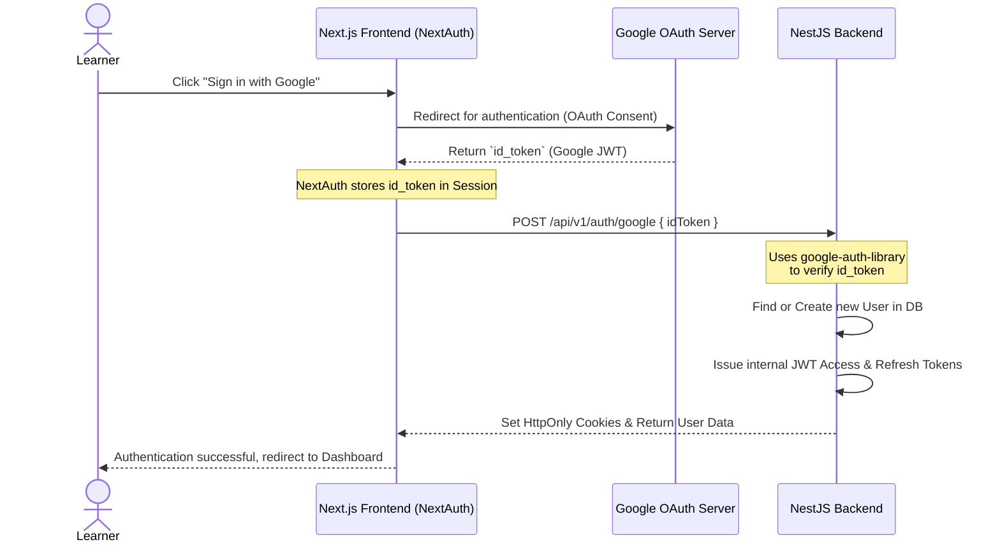

# Google OAuth 2.0 Authentication Flow

This document details the Google OAuth authentication flow in the LearnHub project, illustrating the communication between Next.js (Frontend via NextAuth) and NestJS (Backend).

## 1. Sequence Diagram

The authentication process consists of four main stages:



## 2. Frontend Configuration (NextAuth)

**NextAuth** acts as an intermediary to request permissions from Google.

In `client/src/lib/next-auth.config.ts`, NextAuth is configured with the Google Provider:
- It processes the Google **id_token** via the `jwt` callback.
- The `id_token` is then exposed to the client-side session via the `session` callback.

```typescript
// Excerpt from client/src/lib/next-auth.config.ts
callbacks: {
  async jwt({ token, account }) {
    if (account) {
      token.idToken = account.id_token; // Capture Google's ID Token
    }
    return token;
  },
  async session({ session, token }) {
    session.idToken = token.idToken as string; // Expose ID Token to the session
    return session;
  }
}
```
**Purpose:** NextAuth is strictly utilized to securely obtain the Google `id_token`. It does not generate the core access tokens used for interacting with the LearnHub backend APIs.

## 3. Frontend to Backend Handshake

Once the Frontend retrieves `session.idToken` from NextAuth, it immediately dispatches a `POST` request to the NestJS Backend:

```json
POST /api/v1/auth/google
Content-Type: application/json

{
  "idToken": "eyJhbGciOiJSUzI1... (Google-issued JWT)"
}
```

## 4. Backend Processing (NestJS)

The Backend serves as the absolute authority for authorization and does not blindly trust data transmitted from the Frontend.

**In `server/src/modules/auth/auth.controller.ts`:**
The controller receives the `/auth/google` request and passes the `idToken` to the AuthService.

**In `server/src/modules/auth/auth.service.ts`:**
The verification process involves three strict steps:

### Step 4.1: Token Verification
```typescript
const ticket = await this.googleClient.verifyIdToken({
  idToken,
  audience: this.configService.get<string>('google.clientId'),
});
const payload = ticket.getPayload(); // Extracts { email, name, picture }
```
The `google-auth-library` validates the digital signature, checks expiration, and ensures the `audience` precisely matches the LearnHub `GOOGLE_CLIENT_ID`. This critical step prevents the **Confused Deputy Problem** (where a valid token from another application is maliciously reused against our application).

### Step 4.2: Database Synchronization
- If the Email logs in for the first time $\implies$ The Backend creates a new User with `status: 'ACTIVE'` and `isEmailVerified: true` (since Google has already verified the email's authenticity).
- If the Email already exists $\implies$ The Backend updates the user profile (e.g., fetching a missing avatar).

### Step 4.3: Token Swapping (Identity Provider Swap)
This step represents a core architectural decision. The Backend discards the Google-issued token and issues securely signed **Access Tokens** and **Refresh Tokens** specific to the LearnHub ecosystem:
```typescript
const [accessToken, refreshToken] = await Promise.all([
  this.generateAccessToken(user.id, user.userType),
  this.generateRefreshToken(user.id),
]);
```

Finally, the Backend securely injects these tokens into **HttpOnly Cookies** via `setAuthCookies(res, ...)` and returns the authorized User payload (`id, email, roles, permissions`) back to the Frontend.

## 5. Architectural Benefits

This pattern provides significant advantages:
1. **Frontend Simplicity:** Delegates complex multi-provider OAuth UI and redirection flows to NextAuth.
2. **Backend Authority:** Internal tokens are managed entirely by the NestJS API. Future permission changes or RBAC enforcements instantly apply via the LearnHub JWT, independently of Google.
3. **Maximum Security:** Utilizing HttpOnly Cookies mitigates Cross-Site Scripting (XSS) risks, keeping the internal Access & Refresh tokens completely hidden from client-side JavaScript.
